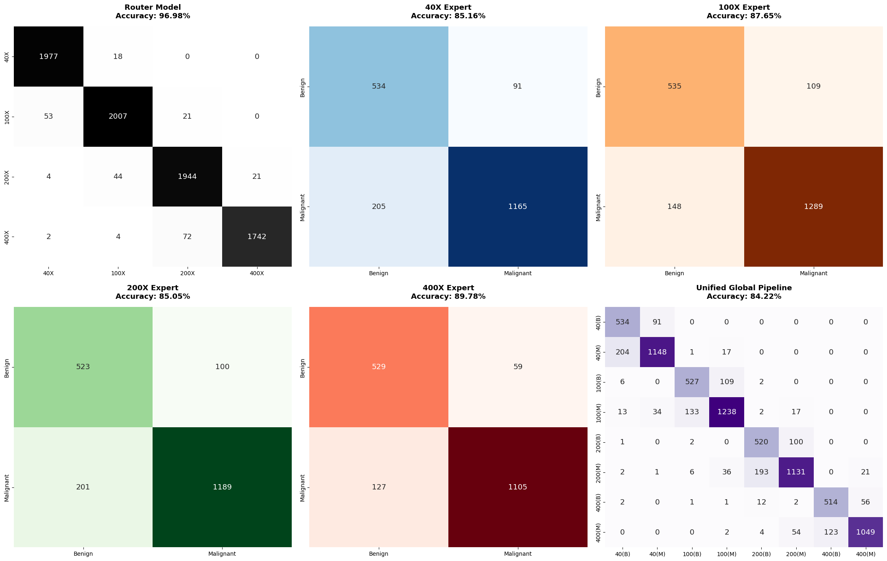

# Hierarchical Multi-Model CNN for Breast Cancer Histopathology

This repository contains a custom-built, two-tier hierarchical Convolutional Neural Network (CNN) pipeline designed to classify breast cancer histopathology images from the BreaKHis dataset. 

Instead of relying on a single model to learn complex cellular structures across vastly different zoom levels, this architecture uses a Router model to detect the magnification level, which then dynamically passes the image to one of four specialized Expert models for clinical diagnosis (Benign vs. Malignant).

## Architecture Overview
The pipeline is built entirely from scratch in PyTorch and operates in two sequential phases:

1. The Router Guard (Magnification Routing): A CNN trained to identify the microscopic zoom level of the input image (40X, 100X, 200X, or 400X).
2. The Clinical Experts (Disease Classification): Four independent CNNs, each trained exclusively on a specific magnification level. The Router dynamically selects the correct Expert to evaluate the image for Benign or Malignant tumors.

The final integration of these components is contained within the MultiModel pipeline, which automates the hand-off from detection to diagnosis.

## Dataset Source
The models were trained and evaluated using the BreaKHis (Breast Cancer Histopathological Image Classification) dataset. You can find the dataset on Kaggle here:
https://www.kaggle.com/datasets/ambarish/breakhis

## Pipeline Performance
The architecture successfully prevents the feature-blurring that occurs when mixing magnification scales, resulting in highly accurate generalizations. ( The Bottom Right Matrix is for the Pipeline Results )

## Repository Structure
* /notebooks: Contains the Jupyter notebooks used for data preprocessing and model training on Kaggle.
* /models: Contains the trained .pth weight files for the Router and all four Experts.
* /data: Contains the standardized CSV mapping files used for the PyTorch DataLoaders.

## Key Technologies & Techniques
* Frameworks: PyTorch, OpenCV, Pandas, NumPy, Matplotlib.
* Computer Vision: Custom CNN architecture featuring Adaptive Average Pooling to handle variable high-resolution medical images natively (700x460).
* Optimization: Custom-calculated Image Normalization (Mean/Std) specifically calibrated for the pink/purple hues of H&E stained histopathology slides.
* Explainable AI: Integrated PyTorch Grad-CAM to generate heatmaps, proving the models are focusing on cellular structures rather than background artifacts.

---
Developed by Salah Eddine Kourradi (SEK171)
